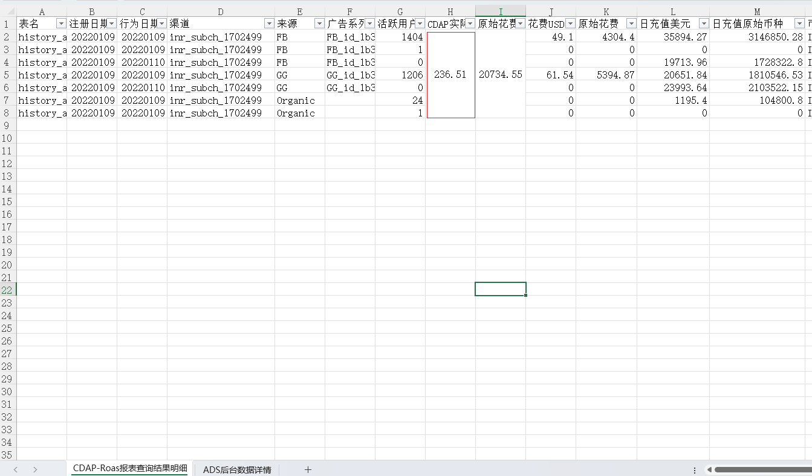
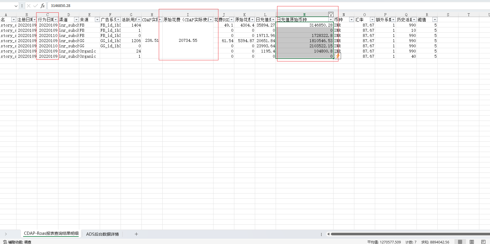
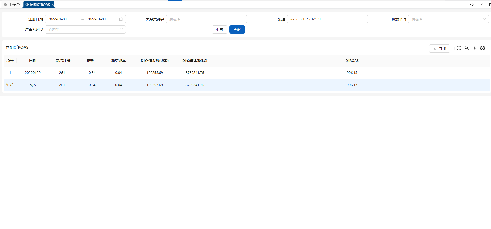

### cdap与ads广告后台数据验证脚本使用说明

#### 脚本功能

> 取当天的cdap页面ROAS同期群d0的活跃人数和Roas分子充值金额和Roas分母花费和广告后台页同期群ROAS详细记录进行对比操作。
>
> 本测试使用币种为inr 的渠道进行验证。

### 实现逻辑差异说明

#### 查询表差异

> cdap 使用 `history_active_cohort_cost_calculate_trend` 数据表进行数据查询
>
> ads 使用`history_active_cohort_cost_calculate_trend_campaign`数据表进行数据查询

#### 花费统计逻辑差异

>
> cdap 使用入参的dates+channel 进行sum，聚合这一天的花费
>
> ads 对数据按照dates+channel+campaign_id进行数据分组， 然后根据dates+campaign_id聚合这一天这一个广告系列的花费，然后进行累加
>
> 二者的实现逻辑在花费的统计结果上会有显著的差异
>
 #### 关联表差异
>
> cdap目前只有`history_active_cohort_cost_calculate_trend`和`history_active_channel_config_detail`关联查询
>
> ads 目前`ad_keywords_campaign`+`history_active_cohort_cost_calculate_trend_campaign`+`history_active_channel_config_detail`三者关联查询
>
> ads 广告后台目前内联`ad_keywords_campaign`这个表，这个表里边不会有自然量的统计数据的广告系列id，所以二者的在充值金额和新增注册数上都会有差异

### 配置说明

数据库连接配置同历史版本保持一致

### Excel 对比说明

cdap 新增注册人数对比说明，注册日期和行为日期需要选择一天

花费对比，cdap实际使用的是日期+渠道查的花费

cdap D1 值对比，行为日期要全选 充值累加除以花费

ads广告后台新增注册人数对比说明，注册日期和行为日期需要选择一天

ads广告后台花费是按照每个广告系列的dates+channel+campaign_id 将查询出来得数据分组，然后，根据dates+campaign_id 去聚合花费

